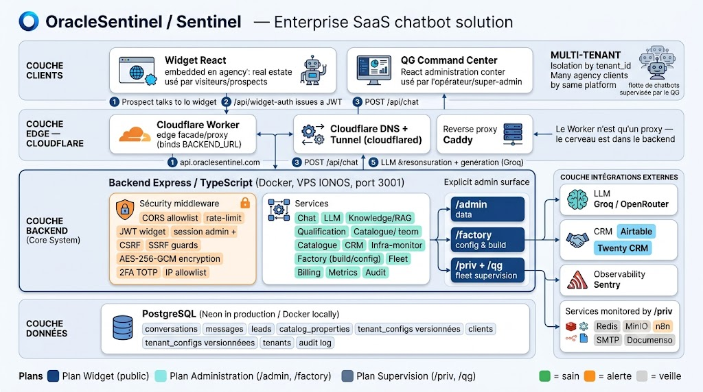

<div align="center">


<br/><br/>


<h3>Plateforme SaaS multi-tenant de chatbots de qualification de leads immobiliers</h3>

<p><em>Un widget conversationnel par agence. Un QG de supervision pour piloter toute la flotte, à distance.</em></p>

<p>
  
  
  
  
  
  
  
</p>

<p>
  <a href="https://www.malt.fr/profile/theosigaud"></a>
  <a href="https://www.linkedin.com/in/theo-s-782851350"></a>
  
</p>

</div>

---

> [!IMPORTANT]
> **Disponible en freelance ou en contrat (CDI/CDD), en full remote depuis la France.**
> Ce dépôt est une démonstration concrète de mes compétences : un produit complet, sécurisé et déployé — pas un slide.
> 👉 Me contacter : **[Malt](https://www.malt.fr/profile/theosigaud)** · **[LinkedIn](https://www.linkedin.com/in/theo-s-782851350)**

---

## ✨ En bref

OracleSentinel intègre, sur le site de chaque agence cliente (un *tenant*), un **widget de chat** qui qualifie les prospects immobiliers, recherche dans le **catalogue de l'agence** (RAG), score le lead, puis le **transmet au bon interlocuteur**. Un **Command Center (QG)** permet au super-admin de superviser et **piloter la flotte à distance** — conçu pour un réseau (objectif 350+ agences).

- 🧩 **Multi-tenant** — isolation stricte par `tenant_id` ; catalogue, leads et conversations cloisonnés par agence.
- 🤖 **Conversationnel + RAG** — LLM (Groq / OpenRouter) + recherche catalogue, qualification et scoring du lead.
- 🛰️ **QG de supervision & contrôle distant** — santé de la flotte, métriques réelles, config par agence **versionnée**, **redéploiement contrôlé**.
- 🔒 **Sécurité défense-en-profondeur** — JWT, sessions + CSRF, garde SSRF, chiffrement AES-256-GCM au repos, 2FA TOTP.
- 🏭 **Industrialisé** — Docker multi-stage non-root, healthchecks, CI (typecheck + tests + build + e2e + audit).

---

## 🏗️ Architecture

<div align="center">
  
</div>

Le système s'organise en **trois plans d'accès** et **quatre couches**.

**Trois plans :**
1. **Plan widget** *(public, par tenant)* — conversation et capture de lead, authentifié par un JWT lié à l'origine.
2. **Plan administration** *(opérateur)* — `/admin` (données) et `/factory` (configuration & build des agents).
3. **Plan supervision** *(super-admin)* — `/priv` + le **Command Center React** servi à `/qg`.

**Quatre couches :**

| Couche | Rôle |
|---|---|
| **Clients** | Widget React (sites agences) + QG Command Center (administration) |
| **Edge — Cloudflare** | Worker (façade/proxy), DNS + tunnel, reverse-proxy **Caddy**. *Le Worker n'est qu'un proxy — le cerveau est dans le backend.* |
| **Backend** | **Express + TypeScript** (Docker, VPS, port 3001) : middleware de sécurité, services métier, surfaces d'admin `/admin` · `/factory` · `/priv` · `/qg` |
| **Données** | **PostgreSQL** (Neon en production, Docker en local) — schéma idempotent appliqué au démarrage |

**Intégrations externes :** Groq / OpenRouter (LLM) · Airtable / Twenty (CRM) · Sentry (observabilité) · services monitorés par `/priv` (Redis, MinIO, n8n, SMTP, Documenso).

> **Décision de conception clé** — un seul process backend sert **tous** les tenants (différenciés par `tenant_id`), plutôt qu'un process par agence. Le contrôle distant par agence repose donc sur une **couche de configuration par tenant** (stockée, versionnée, appliquée et redéployée pour une agence sans perturber les autres).

---

## 🧰 Stack technique

| Couche | Technologies |
|---|---|
| **Frontend** | React 18, Vite 6, TypeScript, TailwindCSS, Radix UI, Recharts, Sentry |
| **QG (Command Center)** | React (`src/dashboard/`), servi en production sur `/qg` |
| **Backend** | Node 20, Express, TypeScript, `jose` (JWT), Zod, `pino` |
| **Base de données** | PostgreSQL (Neon en prod), schéma idempotent au démarrage |
| **LLM / IA** | Groq (principal), OpenRouter (fallback) |
| **CRM** | Airtable (webhook) · Twenty (API), par agence — secrets chiffrés |
| **Sécurité** | rate-limit (store Postgres), CSRF, garde SSRF, AES-256-GCM, 2FA TOTP (`better-auth`) |
| **Déploiement** | Docker multi-stage non-root, `docker-compose.production.yml`, healthchecks |
| **Qualité** | Vitest, Playwright (e2e), GitHub Actions CI |

---

## 🔒 Sécurité

Posture **défense-en-profondeur**, implémentée dans le code :

- **Auth widget** : JWT (`jose`, HS256) lié à l'origine, scopes, `tenant_id`, TTL court.
- **Auth admin** : `ADMIN_API_KEY` en comparaison à temps constant → session JWT **HttpOnly**, `SameSite=Strict`, **CSRF** double-submit. Option **2FA TOTP** (RFC 6238) + codes de récupération + break-glass.
- **Isolation multi-tenant** : `tenant_id` filtré dans toutes les requêtes ; RLS PostgreSQL disponible en défense additionnelle.
- **Secrets au repos** : chiffrement **AES-256-GCM** (clé `APP_ENCRYPTION_KEY`) pour les identifiants CRM par agence et le secret TOTP ; jamais renvoyés par l'API, jamais loggés.
- **Entrées & réseau** : validation **Zod** stricte ; **garde SSRF** (anti DNS-rebinding, `redirect: manual`) sur les webhooks ; vérification **manuelle de signature** des webhooks Stripe (HMAC-SHA256, temps constant).
- **En-têtes & transport** : CSP stricte sur `/qg`, `X-Frame-Options`, CORS allowlist en prod, rate-limit persistant, allowlist d'IP admin optionnelle.
- **Observabilité** : Sentry, logs `pino` structurés (redaction PII), healthchecks.

---

## 🛰️ Le QG — Command Center

| URL | Rôle | Auth |
|---|---|---|
| `/qg` | **Command Center React** : vue flotte, santé, chatbots, surveillance, conversations, infra | session admin |
| `/priv` | Supervision infra + flotte (page légère, repli) | session admin |
| `/admin` | Visualisation DB par tenant, CRUD catalogue, purge tenant | session + CSRF |
| `/factory` | Configuration agent, build, tests de connexion, import knowledge, rollback | session + CSRF |

**Contrôle distant des chatbots** (sous `/api/priv/*`, gated) :
- **Provisioning** d'une nouvelle agence + génération du snippet d'intégration.
- **Configuration par tenant versionnée** (création de version, jamais d'écrasement) + **rollback** en un clic.
- **Redéploiement contrôlé** avec confirmation explicite et verrou *single-flight*.
- **Vue Cloudflare Workers** (lecture seule) avec health-ping réel.
- **Métriques réelles** par bot, mur de **surveillance**, **facturation** (Stripe) & quotas, opérations **RGPD**, **journal d'audit** append-only.

---

## 🚀 Démarrage rapide

**Prérequis :** Node 20, npm, une base PostgreSQL (Neon ou locale).

```bash
# 1) Backend
cd server
cp .env.example .env        # renseigner DATABASE_URL, GROQ_API_KEY, ADMIN_API_KEY, JWT_SECRET, ...
npm install
npm run dev                 # API sur http://localhost:3001

# 2) Frontend (depuis la racine, autre terminal)
npm install
npm run dev                 # widget + QG sur http://localhost:3000 (proxy /api -> 3001)
```

Vérifier qu'on peut déployer (DB + LLM + CRM + readiness) :

```bash
cd server && npm run deploy:check     # feu vert / rouge sur un serveur lancé
```

---

## 🐳 Déploiement

```bash
docker compose -f docker-compose.production.yml up -d --build
```

Image multi-stage, utilisateur **non-root**, **healthchecks**, et **`restart: unless-stopped`** sur le serveur et la base → le service se relève automatiquement (et survit à un redémarrage de l'hôte). Données sur volume persistant, logs en rotation. Cible : VPS (cohabitation Twenty/n8n) derrière Caddy + Cloudflare.

> ⚠️ En production : définir `POSTGRES_PASSWORD`, un `ADMIN_SESSION_SECRET` distinct de `ADMIN_API_KEY`, et `APP_ENCRYPTION_KEY` (64 hex) si le CRM par agence ou la 2FA sont activés. Garder le dépôt **privé** si des secrets devaient y être ajoutés.

---

## 🧪 Tests & CI

```bash
cd server && npx vitest run     # tests backend (services, middleware, SSRF, CRM, qualification…)
npm run test                    # tests frontend
npx playwright test             # e2e (desktop + mobile)
```

CI GitHub Actions : typecheck → tests → build → e2e → `npm audit`.

---

## 📁 Structure du dépôt

```
.
├── src/                  Frontend (widget React + QG dans src/dashboard/)
├── server/               Backend Express + PostgreSQL
│   └── src/{routes,services,middleware,db,factory,validators,utils}
├── Dockerfile.production · docker-compose.production.yml
└── README.md
```

---

## 👤 Auteur & disponibilité

**Theo S.** — Développeur Web Full-Stack · Chartres, France · **full remote**.

J'ai conçu OracleSentinel de bout en bout : architecture multi-tenant, backend sécurisé, intégration LLM/RAG, QG de pilotage à distance et chaîne de déploiement Docker. Je cherche à mettre cette approche « produit, sécurité et industrialisation » au service d'une équipe.

**Disponible en freelance ou en contrat (CDI/CDD), full remote depuis la France 🇫🇷.**

- 💼 **Malt** : https://www.malt.fr/profile/theosigaud
- 🔗 **LinkedIn** : https://www.linkedin.com/in/theo-s-782851350

---

## 📄 Licence

Propriétaire — tous droits réservés. Construit avec soin pour la qualification de leads immobiliers.
