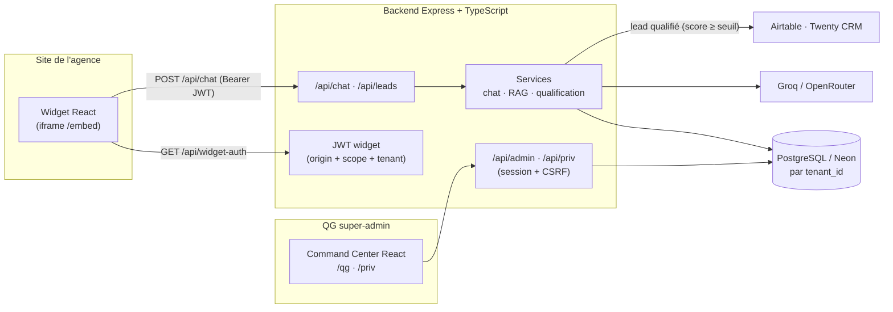

<div align="center">

# 🛡️ OracleSentinel — Sentinel Chatbot

**Plateforme SaaS multi-tenant de chatbots de qualification de leads immobiliers.**
Un widget conversationnel par agence, un QG de supervision pour piloter toute la flotte.


</div>

---

## ✨ En bref

OracleSentinel intègre, sur le site de chaque agence cliente (un *tenant*), un **widget de chat** qui qualifie les prospects immobiliers, recherche dans le **catalogue de l'agence** (RAG), score le lead, puis le **pousse vers le CRM** de l'agence. Un **Command Center (QG)** permet au super-admin de superviser la flotte — pensé pour **350+ agences**.

- 🧩 **Multi-tenant** — isolation par `tenant_id`, catalogue/leads/conversations cloisonnés par agence.
- 🤖 **Conversationnel + RAG** — LLM (Groq) + recherche catalogue, qualification et scoring de lead.
- 🛰️ **QG de supervision** — santé de la flotte, activité, infrastructure, gestion par agence.
- 🔒 **Sécurité défense-en-profondeur** — voir [§ Sécurité](#-sécurité).
- 🏭 **Industrialisé** — Docker multi-stage non-root, CI (typecheck + tests + build + e2e + audit + Snyk).

---

## 🏗️ Architecture



**Trois plans :** widget (public, par tenant) · administration (`/admin`, `/factory`) · supervision (`/priv`, `/qg`).

---

## 🧰 Stack technique

| Couche | Technologies |
|---|---|
| **Frontend** | React 18, Vite 6, TypeScript, TailwindCSS, Radix UI, Recharts, Sentry |
| **QG (Command Center)** | React (`src/dashboard/`), servi en prod sur `/qg` |
| **Backend** | Node 20, Express, TypeScript, `jose` (JWT), Zod, `pino` |
| **Base de données** | PostgreSQL (Neon en prod), schéma idempotent au démarrage |
| **LLM / IA** | Groq (principal), OpenRouter, SDK Anthropic |
| **CRM** | Airtable (webhook), Twenty (API) |
| **Sécurité** | rate-limit (store Postgres), CSRF, garde SSRF, better-auth (2FA TOTP, optionnel) |
| **Déploiement** | Docker multi-stage non-root, `docker-compose.production.yml` |
| **Qualité** | Vitest, Playwright (e2e), GitHub Actions CI + Snyk |

---

## 📁 Structure du dépôt

```
.
├── src/                  Frontend (widget React + QG dans src/dashboard/)
├── server/               Backend Express + PostgreSQL
│   └── src/{routes,services,middleware,db,factory,validators,utils}
├── bibliotheque/         📚 TOUTE la documentation (audit, archi, décisions, agents)
├── Dockerfile.production · docker-compose.production.yml
└── README.md
```

> 🗺️ **Carte détaillée du code** et où trouver quoi : [`bibliotheque/README.md`](bibliotheque/README.md).

---

## 🚀 Démarrage rapide

**Prérequis :** Node 20, npm, une base PostgreSQL (Neon ou locale).

```bash
# 1) Backend
cd server
cp .env.example .env        # renseigner DATABASE_URL, GROQ_API_KEY, ADMIN_API_KEY, JWT_SECRET, ...
npm install
npm run dev                 # API sur http://localhost:3001

# 2) Frontend (depuis la racine, autre terminal)
npm install
npm run dev                 # widget + QG sur http://localhost:3000 (proxy /api -> 3001)
```

Vérification complète (typecheck + tests + build + audit) :

```bash
npm run verify              # racine (frontend)
cd server && npm run verify # backend
```

---

## 🛰️ Le QG (Command Center)

| URL | Rôle | Auth |
|---|---|---|
| `/qg` | **Command Center React** : vue d'ensemble, santé de la flotte, chatbots, surveillance, conversations, infra | session admin |
| `/priv` | Supervision infra + flotte (page légère, repli) | session admin |
| `/admin` | Visualisation DB par tenant, CRUD catalogue, purge tenant | session + CSRF |
| `/factory` | Configuration agent, build, tests de connexion, import knowledge, rollback | session + CSRF |

`GET /api/priv/overview` fournit en un appel la **santé par agence** (saine / à surveiller / en veille / sans catalogue), bornée, cachée et **sans PII**.

---

## 🔒 Sécurité

Posture **défense-en-profondeur**, vérifiée dans le code :

- **Auth widget** : JWT (`jose`, HS256) lié à l'origine, scopes, `tenant_id`, TTL court.
- **Auth admin** : `ADMIN_API_KEY` en comparaison à temps constant → session JWT HttpOnly, `SameSite=Strict`, CSRF double-submit.
- **Isolation multi-tenant** : `tenant_id` filtré dans toutes les requêtes ; **RLS PostgreSQL** disponible en défense-en-profondeur (désactivée par défaut, voir `ADR_0003`).
- **Entrées** : validation **Zod** stricte + sanitisation ; **garde SSRF** (anti-rebinding) sur les webhooks.
- **Secrets** : masqués dans l'UI et les sondes infra ; `.gitignore`/`.dockerignore` excluent `.env*` et backups ; TLS DB durcissable (pinning CA).
- **En-têtes & transport** : CSP, `X-Frame-Options`, CORS allowlist en prod, rate-limit persistant.
- **Observabilité** : Sentry, logs `pino` structurés (+ redaction PII), healthchecks.

> Détails et findings : [`bibliotheque/audit/SECURITY_REVIEW.md`](bibliotheque/audit/SECURITY_REVIEW.md) · remédiations : [`REMEDIATION_LOG.md`](bibliotheque/audit/REMEDIATION_LOG.md).

### Variables d'environnement (par nom — voir `server/.env.example`)
`DATABASE_URL` · `JWT_SECRET` · `ADMIN_API_KEY` · `ADMIN_SESSION_SECRET` · `WIDGET_ALLOWED_ORIGINS` · `WIDGET_TENANT_MAP` · `GROQ_API_KEY` · `CRM_PROVIDER` · `AIRTABLE_WEBHOOK_URL` / `TWENTY_API_*` · `SENTRY_DSN`
Durcissement optionnel : `DB_SSL_REJECT_UNAUTHORIZED`, `DB_SSL_CA`, `DB_RLS_ENABLED`, `ADMIN_IP_ALLOWLIST`.

> ⚠️ **En production :** définir `POSTGRES_PASSWORD` (sinon `docker compose` échoue volontairement) et un `ADMIN_SESSION_SECRET` **distinct** de `ADMIN_API_KEY`. Garder le dépôt **privé**.

---

## 🧪 Tests & CI

```bash
cd server && npx vitest run     # tests backend (services, middleware, SSRF, fleet, RLS, CRM…)
npm run test                    # tests frontend (Vitest)
npx playwright test             # e2e (desktop + mobile)
```

CI GitHub Actions : typecheck → tests → build → e2e → `npm audit` → scan Snyk.

---

## 🐳 Déploiement

```bash
docker compose -f docker-compose.production.yml up -d --build
```

Image multi-stage, utilisateur **non-root**, healthchecks. Cible : VPS (cohabitation Twenty/n8n).

---

## 📚 Documentation

Tout est centralisé dans **[`bibliotheque/`](bibliotheque/README.md)** :

| Document | Contenu |
|---|---|
| [`audit/INITIAL_ANALYSIS.md`](bibliotheque/audit/INITIAL_ANALYSIS.md) | Analyse complète + plan |
| [`audit/SECURITY_REVIEW.md`](bibliotheque/audit/SECURITY_REVIEW.md) | Audit sécurité (findings F1–F14) |
| [`architecture/ARCHITECTURE.md`](bibliotheque/architecture/ARCHITECTURE.md) | Architecture réelle, modèle de données |
| [`decisions/`](bibliotheque/decisions/) | ADR (QG, gestion distante, RLS) |
| [`agents/README.md`](bibliotheque/agents/README.md) | Coordination multi-agents |

---

## 🤝 Contribution

- Une **branche par chantier**, jamais de push direct sur `main`.
- Vérifier `npm run verify` (front + back) avant toute PR.
- Ne pas committer de secrets ; ne pas modifier la logique LLM/Groq, le widget ou les payloads CRM sans validation.

---

<div align="center">

**Propriétaire — Tous droits réservés.** · Construit avec soin pour la qualification de leads immobiliers.

</div>
